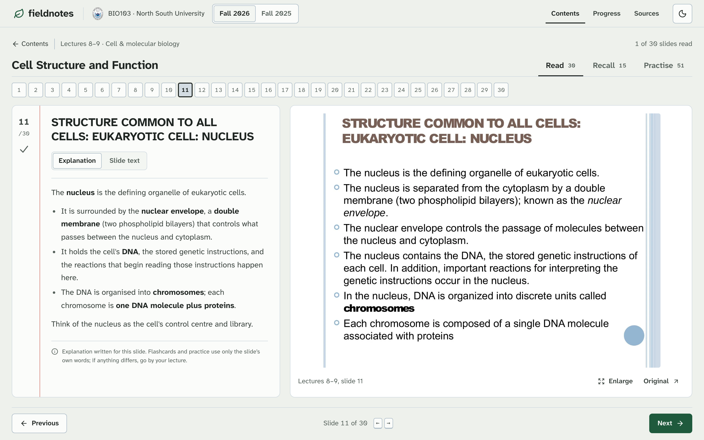
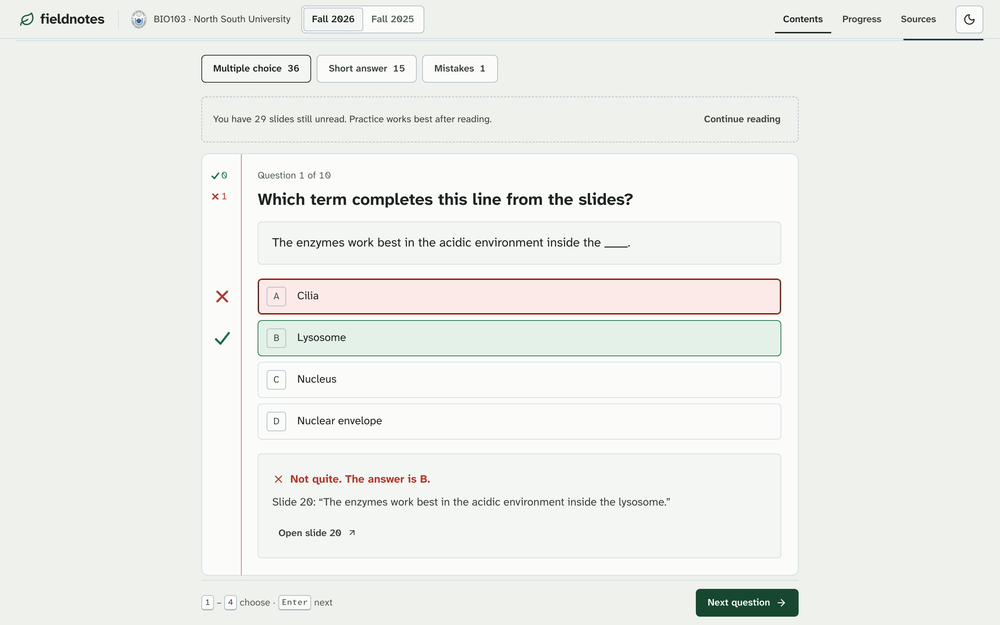
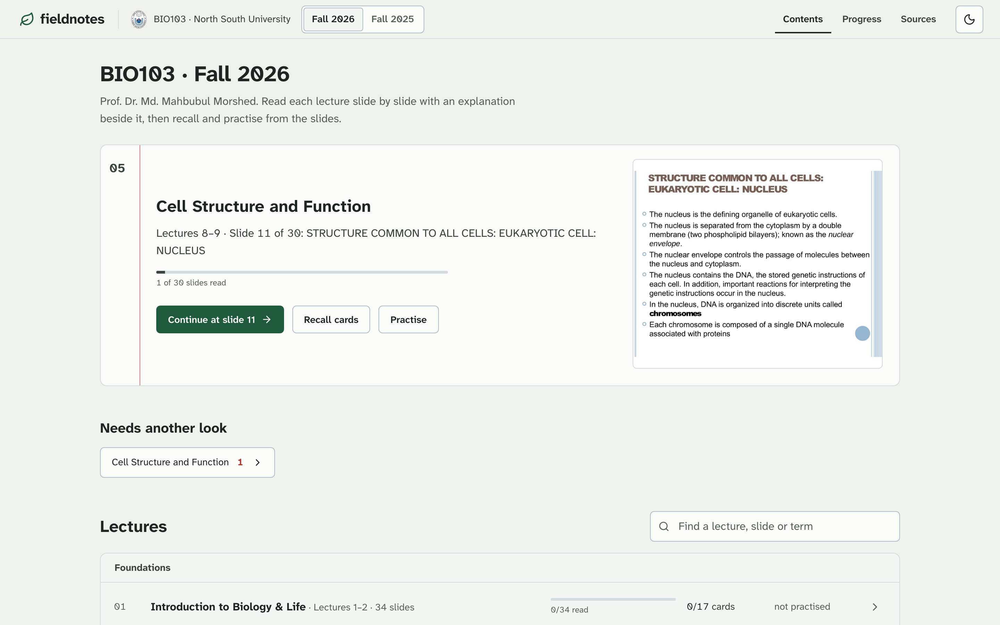
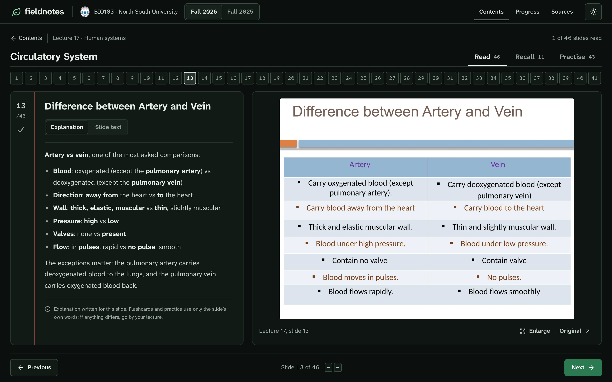
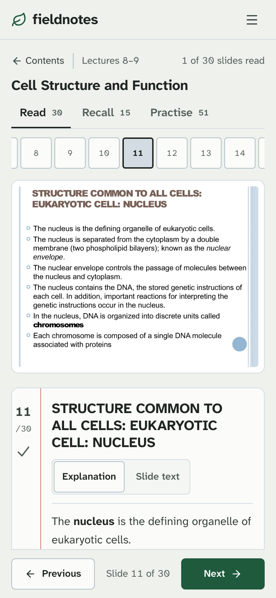
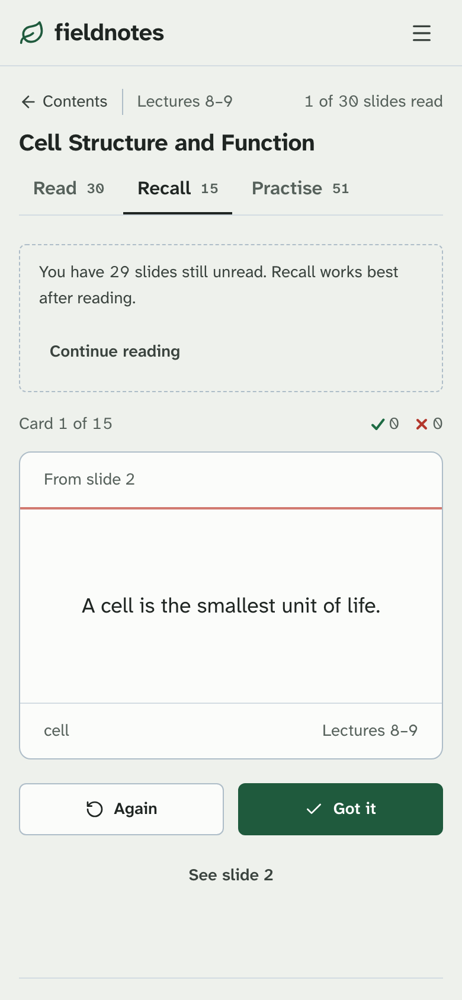

# fieldnotes · BIO103

[](CHANGELOG.md)
[](https://github.com/tahsinulmohsin/bio103-fieldnotes/actions/workflows/ci.yml)
[](#production-status)
[](https://nextjs.org)
[](package.json)

A study app for **NSU BIO103 (Biology I)**, built from the lecture files themselves. For each lecture you **read** every slide with a written explanation beside the original slide, **recall** its terms on flip cards, then **practise** with multiple-choice and short-answer questions answered in the slides' own words.



## Production status

| | |
|---|---|
| **Release** | [v2.0.0](CHANGELOG.md#200---2026-09-26), 2026-09-26 |
| **Environment** | Homelab (CasaOS, Docker Compose), local network only |
| **URL** | http://192.168.31.10:3103 |
| **Health** | `GET /api/health` → `{"status":"ok","app":"bio103-fieldnotes","version":"2.0.0"}` |
| **Last deploy** | 2026-09-25, every 2.0.0 feature. The version label in the footer and `/api/health` appears with the next `./deploy.sh` from the home network. |
| **Rollback** | `deploy.sh` keeps the replaced image as `bio103-fieldnotes:previous` ([deployment/README.md](deployment/README.md)) |
| **Public URL** | Not set up. `bio103.giggly.store.cv` is prepared in `deployment/` but not applied. |

## What's inside

| Semester | Lecturer | Lectures | Slides | Explanations | Flashcards | Multiple choice | Short answer |
|---|---|---:|---:|---:|---:|---:|---:|
| Fall 2026 | Prof. Dr. Md. Mahbubul Morshed (MBMD) | 14 | 411 | 411 | 164 | 418 | 175 |
| Fall 2025 | Prof. Dr. Md. Rakibul Islam (MRIs) | 13 | 439 | 146 | 167 | 374 | 146 |

The Fall 2025 course outline (8 pages) is listed for reference and never used for practice. Switch semesters in the top bar (or the menu on a phone).

## Features

- **Contents**: a "Next up" card that resumes where you stopped, items waiting for another look, and every lecture grouped by part of the course, searchable by lecture title, slide title or term.
- **Read**: one slide at a time. The explanation sits on a ruled notebook page beside the original slide, and a strip of numbered cells shows which slides are read. A slide counts as read after two seconds on screen or when you press Next, and a pencil tick appears in the margin. Keys: ← →.
  - *Explanation*: plain-language notes for the slide, with key terms in bold. Labelled as an explanation and never used for flashcards or answers.
  - *Slide text*: the slide's own words, re-flowed into bullets with sub-bullets and tables kept. Text read from the slide image (local OCR) is a labelled extra.
  - *Enlarge* opens the slide full size; *Original* opens that page of the lecture file.
- **Recall**: flip cards with a term on the front and the slide's exact wording on the back. Mark each *Again* or *Got it* (Space, then ← or →). Missed cards come back once at the end of the round and can be reviewed on their own later.
- **Practise**:
  - *Multiple choice* in rounds of 10, 25 or all. Four options of the same kind, reshuffled every round. Your answer is marked with a tick or cross drawn in the page margin, and the feedback quotes the slide and links back to it. Keys: 1–4 or A–D, then Enter.
  - *Short answer*, like the written part of the exam: "Write the differences between…", "What are the functions of…", "Define…". Write an answer (optional, not graded), show the slide's answer, then mark yourself.
  - *Mistakes*: only the questions you got wrong.
- Recall and Practise are always open. If a lecture still has unread slides, a note suggests reading first.
- **Progress** per lecture (slides read, cards recalled, best score, items to review), saved in the browser per semester, with JSON export.
- Light and dark themes, WCAG 2.2 AA, at least 44px touch targets on phones, and every action works from the keyboard. Motion stops under "reduce motion".

## Screenshots

| Practice, marked in the margin | Contents |
|---|---|
|  |  |

| Dark theme | Phone: Read | Phone: Recall |
|---|---|---|
|  |  |  |

## Quick start

Requires **Node.js 20.9+** (the container uses Node 24). Python 3 is only needed to rebuild or validate content.

```sh
git clone https://github.com/tahsinulmohsin/bio103-fieldnotes.git
cd bio103-fieldnotes
npm ci
npm run dev        # http://localhost:3103
```

Production: `npm run build && npm start` (also on port 3103), or `docker compose up -d --build` (port 3103 → container port 3000).

| Script | What it does |
|---|---|
| `npm run dev` | Development server on port 3103 |
| `npm run build` / `npm start` | Production build and server (standalone output) |
| `npm run typecheck` | TypeScript, no emit |
| `npm run verify:content` | Validates all course content (`scripts/validate_course.py`) |

## How it works

### Content pipeline

```
lecture files ──extract──▶ data/extracted/<semester>.json ──build──▶ data/course-<semester>.json ──▶ app
```

```sh
python3 scripts/extract_course.py      # Fall 2025 → data/extracted/fall2025.json
python3 scripts/extract_fall2026.py    # Fall 2026 → data/extracted/fall2026.json
python3 scripts/build_course.py        # notes, flashcards, questions, short answers → data/course-*.json
python3 scripts/validate_course.py     # or: npm run verify:content
```

The extracted text, built courses, slide images and lecture files are all committed, so the app builds without the original lecture folders.

- **Extraction** needs Python 3 with Pillow, Poppler (`pdftotext`, `pdfinfo`, `pdftoppm`) and LibreOffice. The extractors read the lecture folders `BIO103 - Fall 2025 - MRIS` and `BIO103 MBMD` next to the repository by default; pass `--source-dir` to use another location. Existing slide images are reused unless `--rerender` is given.
- **Building and validating** need only Python's standard library.
- **Flashcards**: Fall 2025 uses curator-chosen literal spans (`scripts/practice_spans.json`). Fall 2026 cards come from defining sentences ("X is a …", "… called X", "X: …") and are reviewed in `scripts/card_review_fall2026.json`. Added cards must be verbatim slide text or the build fails.
- **Explanations** live in `scripts/explanations/<semester>/<lecture>.json`, keyed by slide number. Fall 2025's earlier hand-written notes in `scripts/polished/` are merged in.
- **Short-answer prompts** come from the slides' structure: comparison tables, question-titled slides with a short list, and definition cards. The model answer is always literal slide text.
- **OCR** of the slide images (`data/source-ocr.json`, `data/mbmd-ocr.jsonl`) was made on macOS with Apple Vision (`scripts/ocr_source.swift`). It is only needed to regenerate those files.

`validate_course.py` runs about 32,000 assertions. It checks source and image hashes and full slide coverage. It checks that every note, title, flashcard, quiz explanation and short-answer model answer is literal slide text, and that every Fall 2026 slide has an explanation. Every question must also be fair:
- four distinct options of the same kind;
- neither the answer nor any distractor appears in the prompt;
- no option contains another;
- the answer is never the only option sharing a word with the prompt;
- in description questions, either every option has a blank or none does.

`--reextract` also re-reads every source file. [CONTENT_SOURCES.md](CONTENT_SOURCES.md) has the full provenance.

### App

- Only a small index (lecture titles, slide titles, terms, counts) ships with the page. Each lecture's content is prerendered as static JSON at `/course-data/<semester>/<lecture>` and fetched when the lecture opens.
- The runtime dependencies are Next.js, React and `lucide-react`. Styling is one plain CSS file with design tokens for both themes. All motion is CSS (button press, card flip, margin marks).
- Hash routes: `#/`, `#/progress`, `#/sources`, `#/lecture/<id>[/<slide>|/recall|/practise]`.
- Progress lives in `localStorage` per semester and does not sync between devices.

### Project structure

```
app/                  page, layout, globals.css, /api/health, /course-data/[semester]/[module]
components/           study-app (shell, routes), home, lecture (Read), recall, practise, pages, text, ui
lib/                  course index (server), progress, per-lecture loader, types, version
scripts/              extract → build → validate, explanations, card review
data/                 extracted text, built courses, OCR, cover records
public/               slide images, lecture files and their PDF renderings, NSU logo
deployment/           homelab and public-route configuration
tools/ui-qa/          Playwright + axe screenshots, layout and accessibility checks
docs/screenshots/     images used in this README
.impeccable/          design context, direction, critique and review captures
```

## Deployment

`./deploy.sh` runs from a machine on the same network as the homelab:
1. It copies the project to `~/bio103` on `192.168.31.10` over SSH.
2. It tags the running image `bio103-fieldnotes:previous` and builds the new one there.
3. It recreates the container and waits for `/api/health`.

The container runs as a non-root user with a read-only root filesystem, all capabilities dropped and `no-new-privileges`. [deployment/README.md](deployment/README.md) covers rollback, manual steps and the optional Cloudflare Tunnel + Nginx Proxy Manager route.

## Quality checks

- **CI** ([.github/workflows/ci.yml](.github/workflows/ci.yml)) runs on every push, tag and pull request: content validation, type check, production build and a health check.
- **UI QA** ([tools/ui-qa](tools/ui-qa/README.md)): screenshots of every stage at laptop and phone sizes in both themes. It checks overflow, text size, touch targets and axe (WCAG 2.2 AA), and tests that the Read view fits above the bottom bar. For v2.0.0: no overflow, no text under 12px, and every phone target is at least 44px. axe reports nothing on 13 screens except `target-size` on a button momentarily scrolled under the sticky top bar.
- **Design system**: [DESIGN.md](DESIGN.md) (tokens, type, components, rules) and [PRODUCT.md](PRODUCT.md) (users, purpose, constraints).

## Releases and versioning

Versions follow [Semantic Versioning](https://semver.org/). Each release is an annotated tag `vX.Y.Z` with a GitHub release, and [CHANGELOG.md](CHANGELOG.md) records what changed. The running version is shown in the app footer and returned by `/api/health`.

| Tag | Date | Summary |
|---|---|---|
| `v2.0.0` | 2026-09-26 | Explanations for every slide, Read → Recall → Practise, short answers, fair questions, new interface |
| `v1.0.0` | 2026-09-25 | First version (source snapshot recovered from a backup; slide images and lecture files not included) |

To release:
1. Bump `version` in `package.json` and the version badge above.
2. Add a CHANGELOG entry.
3. Commit, then tag and publish:

   ```sh
   git tag -a vX.Y.Z -m "vX.Y.Z"
   git push origin main --follow-tags
   gh release create vX.Y.Z --notes-from-tag
   ```

4. Run `./deploy.sh` and check `/api/health` reports the new version.

## Content and rights

The lecture files, slide images and slide text belong to their authors, Prof. Dr. Md. Mahbubul Morshed and Prof. Dr. Md. Rakibul Islam (North South University). They are included for personal study and are **not** covered by any license in this repository. Keep the repository private unless you have permission to share them. The code has no license yet (all rights reserved by default); add a `LICENSE` file before sharing it.
